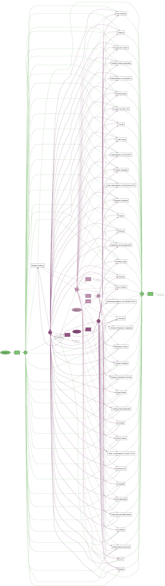

# MIMIC-IV-Object-Centric-Process-Mining

## Overview

Welcome to the MIMIC_OCEL1.0 project! This research focuses on applying Object-Centric Process Mining (OCPM) to the MIMIC-IV healthcare dataset. The project aims to uncover complex patient-care workflows and improve healthcare process insights by transforming relational data into Object-Centric Event Logs (OCEL).

## Project Structure

The research can be divided into three main steps:

1. **Generating an Event Log**  
   This step involves extracting relevant data from the MIMIC-IV database and creating an event log. You can find the implementation in the `mimic_extraction` folder.

2. **Event Log Analysis**  
   In this step, we analyze the generated event log to identify intricate interactions within the patient-care workflow. The analysis is contained within the `event_log_analysis` folder.

3. **Discovery**  
   We utilize the PM4Py library for process discovery to visualize and model the extracted workflows.

4. **Converting Event Log to OCEL**  
   After analysis, the traditional event log is transformed into an Object-Centric Event Log (OCEL), enabling a more nuanced examination of object interactions.

5. **Generating a Process Model from OCEL**  
   Finally, we create a process model using the OCEL, which is located in the `discovery` folder.

## Getting Started

### Prerequisites

To run this project, you will need:

- Python 3.6 or later
- PM4Py library
- Access to the MIMIC-IV database (consider ethical guidelines and data use agreements)

### Installation

1. Clone the repository:

   ```bash
    git clone https://github.com/yourusername/MIMIC_OCEL1.0.git
    cd MIMIC_OCEL1.0
    pip install -r requirements.txt
   ```

### Usage

1. Generating an Event Log
Navigate to the mimic_extraction folder and run the script to generate the event log from the MIMIC-IV dataset.

2. Event Log Analysis
In the event_log_analysis folder, perform analysis on the generated event log to identify patient-care workflow interactions.

3. Discovery
Utilize PM4Py to discover process models from the analyzed event log.

4. Converting to OCEL
Run the necessary scripts to convert the traditional event log into an Object-Centric Event Log (OCEL).

5. Generating Process Model
In the discovery folder, generate and visualize the process model based on the OCEL.

## Files and Resources

- To access my event log, visit: [Event Log](https://drive.google.com/file/d/1yGLSlFGZ4esa1GBc-c8BFT5ofgkRnnnH/view?usp=sharing)
- To access my OCEL log file, visit: [OCEL Log File](https://drive.google.com/file/d/1pMUfRSlf4veQaqbA3ohBduAiryl2lSSi/view?usp=drive_link)
- To access my process model, see the generated model image: 
